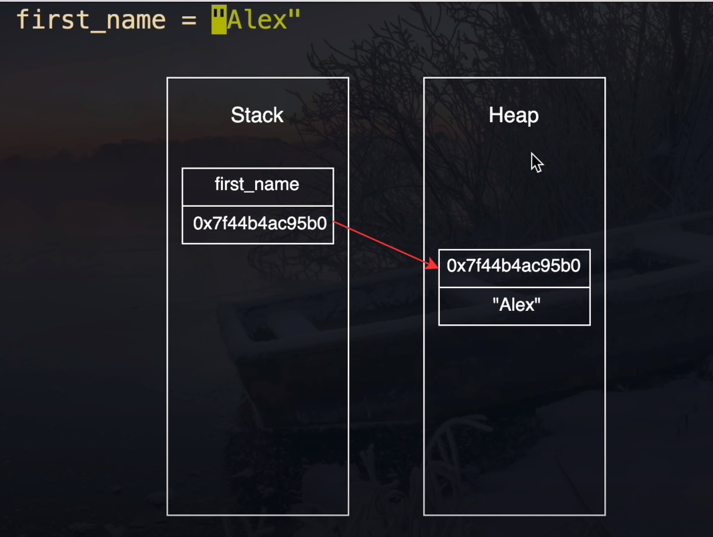
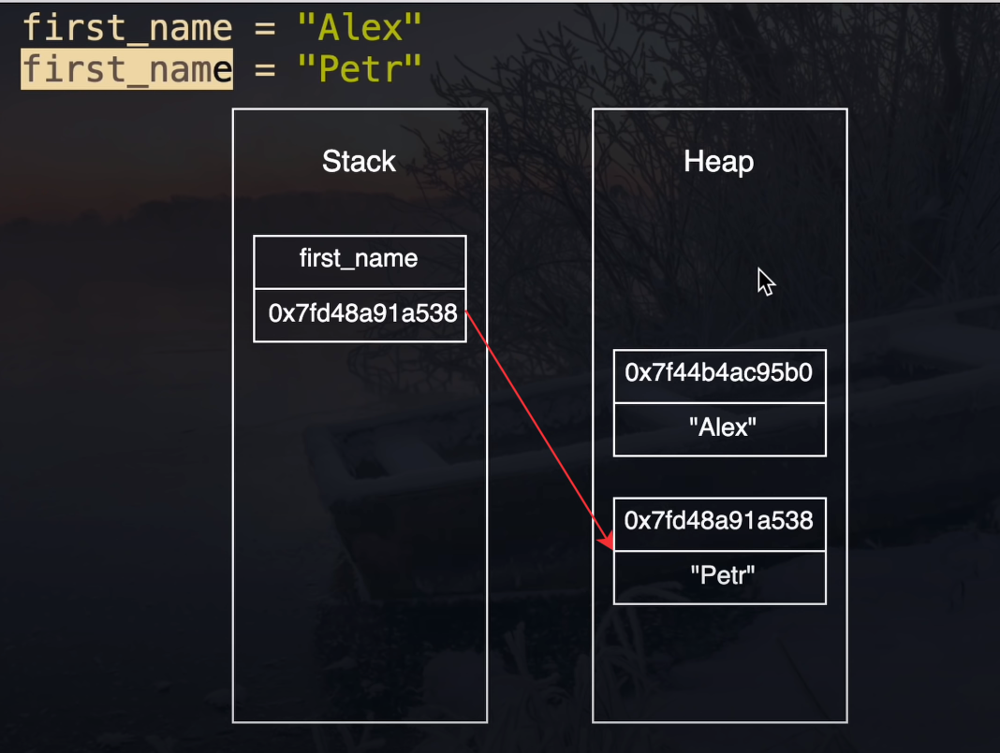

```Python

first_name = "Alex" # var 1
first_name = "Petr" # var 2

```
In Memory, we have 2 types of algorithm 
Stack and Heap

### when ve create the `var1` we save our variable name in Stack and value in Heap 
## like this: 


## then we initialize our variable and change its value




```python
first_name = "Alex"
print(hex(id(first_name)))
print(hex(id(first_name.upper())))

```

```python
names = ["Alex"]
enother_names = ["Alex"]

print(enother_names == names) # True
print(enother_names is enother_names) # False

```

Garbage Collector

```python

import sys

print(sys.getrefcount(None))
```

